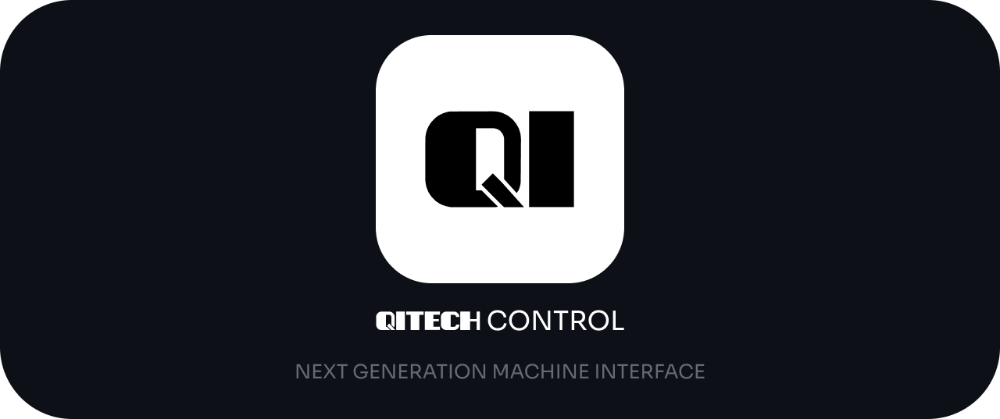

# QiTech Control

QiTech Control is an industrial control panel software for the next generation of QiTech recycling machines built on top of Beckhoff Automation hardware.

# Repo Structure

Frontend

- `/electron`: Frontend code for the control software built with React and Electron.

Backend

- `/server`: Glue between Beckhoff and Electron. Implements machine logic.
- `/stepper-driver`: Generic stepper driver for absolute, relative & speed movements with PID controllers.
- `/ethercat-hal`: Hardware abstraction layer for Beckhoff (and possibly other EtherCat) devices and protocols.
- `/ethercat-hal-derive`: Macros for `ethercat-hal`
- `/control-core`: Core control logic for the server.

Operating System

- `/nixos`: Custom Linux with realtime kernel & preconfigured for touchscreens.

Other

- `/docs`: Documentation for the project.

# Technology Choices

## Backend

To interface with Beckhoff and other EtherCAT devices we need an EtherCAY master stoftware. Possibilities are [PySOEM](https://github.com/bnjmnp/pysoem) (Python), [SOEM](https://github.com/OpenEtherCATsociety/SOEM) (C) and [Ethercrab](https://github.com/ethercrab-rs/ethercrab) (Rust). For realtime operation only C and Rust are suitable. We chose Rust because of safety and confidence in the written code.

[SocketIO](https://socket.io/) was chosen for performant event driven communication from the backend to the server. But we still use REST with [axum](https://docs.rs/axum/latest/axum/) for the communication thet benefits from the request/response model.

We use [Smol](https://github.com/smol-rs/smol) for EtherCAT IO in the control loop for it's performance and [Tokio](https://tokio.rs/) for server IO because of it's ecosystem and maturity.

## Frontend

We could combine the code of the frontend and backend using [Doxius](https://dioxuslabs.com/) but it lacks good Linux support. We chose [Electron](https://www.electronjs.org/) with [React](https://react.dev/) for it's maturity and ecosystem. For the UI we use [Shadcn](https://ui.shadcn.com/) components and [Tailwind](https://tailwindcss.com/) for styling. For routing we use [TanStack Router](https://tanstack.com/router/v1).

# Dev Setup

## Backend

- Rust stable 1.86^ toolchain (install via [rustup](https://rustup.rs/))
- `rust-analyzer` extension for VSCode
- Set your interface in `server/src/ethercat/init.rs` like `en10`
- Connect a Beckhoff EK1100 to your interface
- run `cd server && cargo run` to start the server (localhost:3001)

## Frontend

- nodejs and npm installed
- run `cd electron && npm i && npm run start` to start the frontend

# Machines

| Machine Type | Version | Release Date | Description                 | Change to Previous Version                             | Vendor ID                  | Machine ID | Implemented | Docs                            |
| ------------ | ------- | ------------ | --------------------------- | ------------------------------------------------------ | -------------------------- | ---------- | ----------- | ------------------------------- |
| Winder       | V1      | ???          | Winding Filaments & Similar | -                                                      | 1 (Qitech Industries GmbH) | 1          | Reserved    | -                               |
| Winder       | V2      | 2025         | Winding Filaments & Similar | Reengineered Traverse                                  | 1 (Qitech Industries GmbH) | 2          | In Progress |  |
| Extruder     | V1      | ???          | Single Screw Extruder       | -                                                      | 1 (Qitech Industries GmbH) | 3          | Reserved    | -                               |
| Extruder     | V2      | 2025         | Single Screw Extruder       | PT100 Thermometers, Optional Additional Heating Zone 4 | 1 (Qitech Industries GmbH) | 4          | Not Yet     |                                 |
| Waterway     | V1      | 2025         | Filament Water Cooling      | -                                                      | 1 (Qitech Industries GmbH) | 5          | Not Yet     |                                 |

# More Docs

- [x] [Architecture & Data Flow](./docs/architecture-overview.md)

  - [x] Example Winder V2

- [ ] Electron

  - Folder Structure
  - Routing with TanStack Router
  - Design with Tailwind & Shadcn
  - ...

- [ ] Interfacing with Electron/Server

  - [ ] SocketIO
    - Machine Namespace
    - Main Namespace
  - [ ] REST
    - Machine Mutations
    - Write Device Identification

- Server

  - [ ] Control Loop Setup
    - Control Loop Thread
      - [ ] realtime
    - Maindevice
    - Group
    - Extracting Device Identifications
    - Identifying Groups
    - Validating Machines
    - Run Control Loop
  - [x] [Control Loop](./docs/control-loop.md)
  - [x] [Machine/Device Identification](./docs/identification.md)
  - [ ] Machines
    - When to create a new Machine?
      - Versioning
      - Code sharing
    - Creating/Validating a Machine
      - Validation
      - Configuration
  - [ ] Machine Implementation Guide
    - Link: How to create a Device
    - Link: How to create an Actor
    - Link: How to create a Machine
      - API (SocketIO + REST)
      - Creation/Validation Logic
        - Optional/Mandatory Devices
        - Validate Devices
      - Business Logic
    - Link: How to create Machine Abstraction (Like Traverse/Puller/...)
    - Forward `act` in winder.

- [ ] Control Core

  - [x] [Actors](./docs/actors.md)
  - [ ] SocketIO
    - Namespaces & Caching
    - Joining leaving namespaces
    - NamespaceId
    - Caching
      - Serverside Caching
      - Clientside Caching
  - [ ] REST

- [x] Ethercat HAL

  - [x] [Devices](./docs/devices.md)
  - [x] [Configuration (CoE)](./docs/coe.md)
  - [x] [IO](./docs/io.md)
  - [x] [PDO](./docs/pdo.md)

- [x] [Ethercat Basics](./docs/ethercat-basics.md)

- [ ] Operating System
  - Why
  - How
