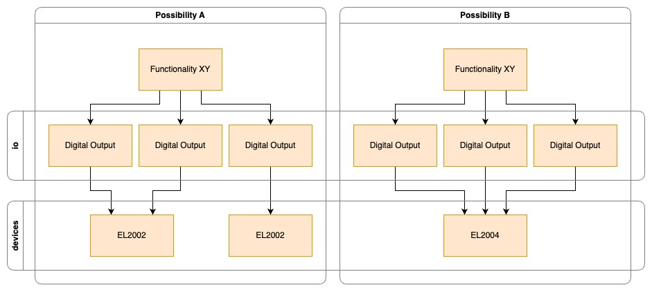

# IO Types
The IO abstraction types create a device-agnostic interface between the machine logic and the devices.
With this possibility, different functionalities can be virtually routed to different devices if they match the IO type.



A hypothetical functionality "XY" needs three digital outputs. On a logical level, it's not important which devices these are; they just have to be digital output devices.
The digital output devices can still have different electrical characteristics which might be important for the application but are not relevant for the machine logic, like direct drive or relay.

A functionality can be virtually wired to any device that matches the IO type. Either to one EL2004 which has 4 digital outputs or to two EL2002 which have 2 digital outputs each. Also, different functionalities can be wired to the same device without interacting with each other.

Functionalities of different machines should not be wired to the same devices because of possibly conflicting configuration and machine identification issues (which devices belong to what machine).

# Implemented IO types

- Digital Output (DO)
- Digital Input (DI)
- Analog Input (AI)
- Analog Output (AO)
- Temperature Input (TI)
- Pulse Train Output (PTO)

# Usage

## Implementing for a device
Since each device has one or multiple ports, it needs to define an enum representing each port/pin.

```rust
#[derive(Debug, Clone)]
pub enum EL2002Port {
    DO1, // Digital Output 1
    DO2, // Digital Output 2
}
```

Then the device must implement the respective device trait like `DigitalOutputDevice`.

The `digital_output_write` is used to set the desired level of the output of a given port.

The `digital_output_state` is used to read the current state of the output of a given port.

```rust
impl DigitalOutputDevice<EL2002Port> for EL2002 {
    fn digital_output_write(&mut self, port: EL2002Port, value: DigitalOutputOutput) {
        match port {
            EL2002Port::DO1 => self.rxpdo.channel1.as_mut().unwrap().value = value.into(),
            EL2002Port::DO2 => self.rxpdo.channel2.as_mut().unwrap().value = value.into(),
        }
    }

    fn digital_output_state(&self, port: EL2002Port) -> DigitalOutputState {
        DigitalOutputState {
            output: DigitalOutputOutput(match port {
                EL2002Port::DO1 => self.rxpdo.channel1.as_ref().unwrap().value,
                EL2002Port::DO2 => self.rxpdo.channel2.as_ref().unwrap().value,
            }),
        }
    }
}
```

## Implementing for an `Actor`

The `act` function of an `Actor` will be called after the inputs are read from the device and before the outputs are written for the next EtherCAT frame.

The actor needs to be constructed with the `DigitalOutput` and hold it in its struct.
```rust
#[derive(Debug)]
pub struct DigitalOutputToggler {
    output: DigitalOutput,
}

```

Implementing the `act` function which will toggle the output every cycle.

The `state` and `write` values are callbacks and must be wrapped with parentheses to be called.
```rust
fn act(&mut self, _now: Instant) -> Pin<Box<dyn Future<Output = ()> + Send + '_>> {
    Box::pin(async move {
        {
            let state = (self.output.state)().await;
            match state.output.into() {
                true => (self.output.write)(false.into()).await,
                false => (self.output.write)(true.into()).await,
            }
        }
    })
}
```

## Getting `DigitalOutput` from a `Device`
With the `new` function of the `DigitalOutput` struct, you can create a new `DigitalOutput` instance from a device and its port. We can then provide this `DigitalOutput` instance to the `Actor` struct.
```rust
let el2002 = EL2002::new();
let digital_output = DigitalOutput::new(el2002, EL2002Port::DO1);
let actor = DigitalOutputToggler::new(digital_output);
```

# Creating a new IO type
To create a new IO type, we must know if it's writable (output) or readable (input), or combined (input/output) type.

We first define the `DigitalOutput` struct with the `write` and `state` fields. Every IO needs a `state` field but only writable types need a `write` field.

The `state` field is an async callback which returns the `DigitalOutputState` struct.

The `write` field is an async callback which takes the value.

```rust
pub struct DigitalOutput {
    pub write: Box<dyn Fn(DigitalOutputOutput) -> Pin<Box<dyn Future<Output = ()> + Send>> + Send + Sync>,
    pub state:
        Box<dyn Fn() -> Pin<Box<dyn Future<Output = DigitalOutputState> + Send>> + Send + Sync>,
}
```

Next, we need to implement the `DigitalOutputState` and `DigitalOutputOutput` structs.

The `DigitalOutputState` contains the timestamps of the output (and inputs if applicable) and the `DigitalOutputOutput` struct (and the input struct if applicable). This is the return type of `DigitalOutput::state`.

The `DigitalOutputOutput` is both contained in the `DigitalOutputState` and is the input type of the `DigitalOutput::write` function. It implements the `From` trait in both directions to `bool` to allow easy access to the inner value on this simple type (as seen in the `act` example above).
```rust
#[derive(Debug, Clone)]
pub struct DigitalOutputState {
    pub output: DigitalOutputOutput,
}

/// Output value
/// true: high
/// false: low
#[derive(Debug, Clone)]
pub struct DigitalOutputOutput(pub bool);

impl From<bool> for DigitalOutputOutput {
    fn from(value: bool) -> Self {
        DigitalOutputOutput(value)
    }
}

impl From<DigitalOutputOutput> for bool {
    fn from(value: DigitalOutputOutput) -> Self {
        value.0
    }
}
```

Now we need to implement the constructor for a `DigitalOutput` instance. The `new` function takes a device and a port and returns a `DigitalOutput` instance.
We need to construct the async closures which is a bit of type madness since we also need to move the device `Arc` into them.
```rust
impl DigitalOutput {
    pub fn new<PORT>(
        device: Arc<RwLock<dyn DigitalOutputDevice<PORT>>>,
        port: PORT,
    ) -> DigitalOutput
    where
        PORT: Clone + Send + Sync + 'static,
    {
        // build async write closure
        let port1 = port.clone();
        let device1 = device.clone();
        let write = Box::new(
            move |value: DigitalOutputOutput| -> Pin<Box<dyn Future<Output = ()> + Send>> {
                let device_clone = device1.clone();
                let port_clone = port1.clone();
                Box::pin(async move {
                    let mut device = device_clone.write().await;
                    device.digital_output_write(port_clone, value);
                })
            },
        );

        // build async get closure
        let port2 = port.clone();
        let device2 = device.clone();
        let state = Box::new(
            move || -> Pin<Box<dyn Future<Output = DigitalOutputState> + Send>> {
                let device2 = device2.clone();
                let port_clone = port2.clone();
                Box::pin(async move {
                    let device = device2.read().await;
                    device.digital_output_state(port_clone)
                })
            },
        );
        DigitalOutput { write, state }
    }
}
```

Lastly, we can create the `DigitalOutputDevice` trait which needs to be implemented by the device.
```rust
pub trait DigitalOutputDevice<PORT>: Send + Sync
where
    PORT: Clone,
{
    fn digital_output_write(&mut self, port: PORT, value: DigitalOutputOutput);
    fn digital_output_state(&self, port: PORT) -> DigitalOutputState;
}

```